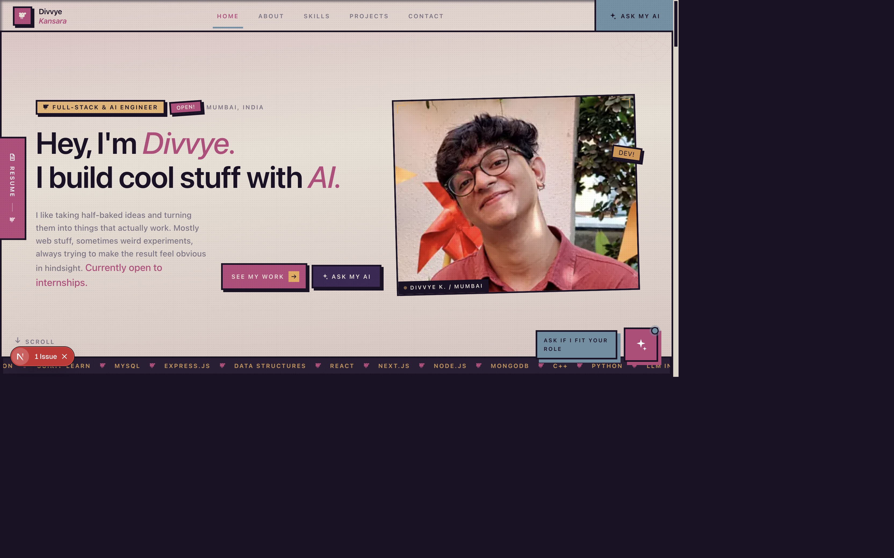

# Divvye Kansara — Portfolio

This is my personal portfolio — a Spider-Verse inspired site where recruiters can browse my work, read project case studies, preview my résumé, and ask an AI assistant questions about my skills and experience. The assistant answers in first person, grounded strictly in my résumé, so nothing gets invented.

---

**I make cool stuff come to life. Wanna take a tour??**
[Live site →](https://github.com/divvyesk/portfolio)



---

[Download my résumé (PDF)](./public/Divvye_Kansara_Resume.pdf)

---


## What It Does


### 1. Landing & Story

The home page walks through who I am and what I've shipped, without feeling like a generic template.

- **Hero:** Animated headline, portrait, marquee ticker, and CTAs to jump into projects or open the AI chat.
- **About & stats:** Education, CGPA, what I'm working on now, and a stats band (DSA problems, products shipped, competition wins).
- **Skills:** Six toolkit cards covering languages, frontend, backend, databases, AI/ML, and tools, each with a short blurb and tag list.


### 2. Projects & Case Studies

Three products I've actually built, each with a landscape screenshot thumbnail and a dedicated case-study page.

- **Project cards:** Live URL chrome, stack chips, summary, and a link to the full write-up.
- **Case-study pages:** Metrics band, overview, highlights, tech stack, live site + repo links, and a handoff to the AI chat for project-specific questions.
- **Featured builds:** [FinOS](https://finos-penny.vercel.app) (AI finance simulator), [HitLab AI](https://hitlab.up.railway.app) (Billboard #1 predictor), and [Rapids QR](https://rapids-qr-code-generator.vercel.app) (offline QR / vCard generator).


### 3. Resume-Grounded AI Chat

A floating chat panel powered by Groq — trained on my résumé, not the open internet.

- **First-person answers:** Speaks as me ("I built", "I've worked with") so it reads like an interview reply.
- **Strict grounding:** Projects, metrics, stack, and achievements come from `lib/resume.ts` only — no fabricated employers or experience.
- **Recruiter-friendly:** Handles vague role questions with one clarifying question, maps job descriptions to concrete builds, and never gives a flat "no."
- **Streaming responses:** Tokens stream in real time; URLs in replies are clickable.


### 4. Résumé Dock & Navigation

Built for people who skim fast and people who read everything.

- **Sticky navbar:** Scroll-spy section links, "Ask my AI" CTA, mobile overlay menu, and a résumé shortcut on smaller screens.
- **Side résumé dock:** Always-visible tab on desktop — opens an in-page PDF preview without leaving the site.
- **Smooth scroll:** Lenis with dynamic `scroll-margin-top` synced to the navbar height, so anchor links land exactly at each section boundary.

---


## Tech Stack

- **Framework:** Next.js 16 (App Router, React 19)
- **Styling:** Tailwind CSS v4 (`@theme` tokens, comic borders, halftone overlays, responsive from 320px up)
- **Animations:** Framer Motion (reveals, parallax hero, magnetic buttons, mobile nav transitions)
- **Smooth scroll:** Lenis
- **AI integration:** Groq SDK (`llama-3.3-70b-versatile` by default) via a streaming `/api/chat` route
- **Content:** Single source of truth in `lib/resume.ts` — UI and chatbot share the same data

---


## Getting Started

```bash
npm install
cp .env.example .env.local   # paste your Groq key into .env.local
npm run dev                  # http://localhost:3000
```


| Variable       | Required | Default                   | Notes                                                          |
| -------------- | -------- | ------------------------- | -------------------------------------------------------------- |
| `GROQ_API_KEY` | yes      | —                         | Free at [console.groq.com/keys](https://console.groq.com/keys) |
| `GROQ_MODEL`   | no       | `llama-3.3-70b-versatile` | Any Groq production model                                      |


The API key is only read server-side inside `app/api/chat/route.ts`. Without it, the site still loads — the chat replies with a friendly "not wired up yet" message.

---


## Folder Structure

```
├── public/                      # Static assets (résumé PDF, portrait, project screenshots)
├── app/
│   ├── api/chat/route.ts        # Groq streaming endpoint for the AI assistant
│   ├── projects/[slug]/page.tsx # Static project case-study pages
│   ├── layout.tsx               # Fonts, metadata, global shell (nav, dock, chat)
│   ├── page.tsx                 # Landing page section composition
│   └── globals.css              # Tailwind v4 theme tokens & comic-style utilities
├── components/
│   ├── Navbar.tsx               # Sticky nav, scroll-spy, mobile overlay menu
│   ├── ResumeDock.tsx           # Side résumé tab + in-page PDF viewer
│   ├── ChatWidget.tsx           # Floating AI chat panel with token streaming
│   ├── SmoothScroll.tsx         # Lenis init + navbar height sync
│   ├── Hero, About, Skills, Projects, AiBand, Achievements, Contact
│   └── ui/                      # Reveal, Marquee, Magnetic, ComicBurst, SpiderWeb, Icons…
├── lib/
│   ├── resume.ts                # Single source of truth for all site content
│   ├── chat-prompt.ts           # System prompt + résumé context for the LLM
│   ├── scroll.ts                # Lenis instance helpers
│   └── events.ts                # Event bus to open chat / résumé from anywhere
└── hooks/
    └── useNavMenuOpen.ts        # Tracks mobile nav for overlay z-index rules
```

---


## Contact

- **Email:** [divvyesk2428@gmail.com](mailto:divvyesk2428@gmail.com)
- **LinkedIn:** [linkedin.com/in/divvye-kansara](https://linkedin.com/in/divvye-kansara)
- **GitHub:** [github.com/divvyesk](https://github.com/divvyesk)

